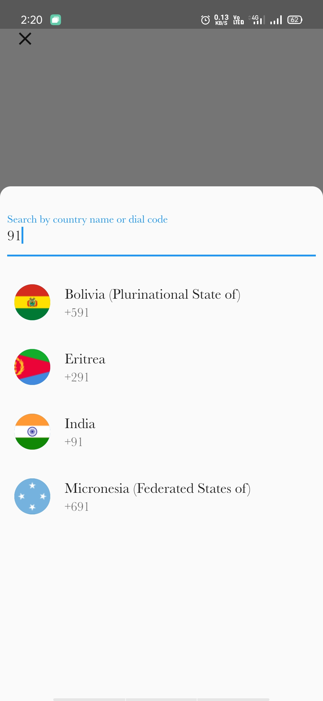

<h1>phone_verification_flutter</h1>

Autofill phone verification app using firebase and flutter framework.

Download this application- <a href="https://github.com/Yashaswi-Anand/PhoneVerification-Flutter/raw/master/screenshots/app-release.apk"> Click here</a> 

<h2>Screenshots</h2>

